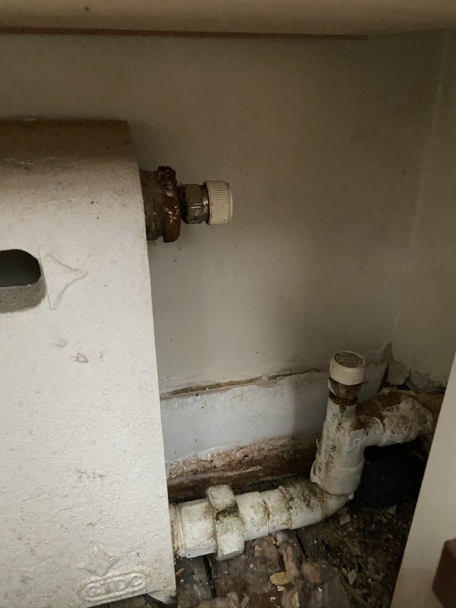

# Maintenance

## Heating

All this information was gathered by Travis Hime.

### Building-wide settings

(This isn't relevant to individual units, but probably good for us to know about.)

I was curious why the heat supply seemed to be on at some times and off at others. I found that this is configured by a panel in the boiler room. (Right now neither the boiler room nor the panel are locked, so anyone with a basement key can potentially mess with the settings.)

The control panel is connected to an outdoor temperature sensor (I don't know where, but presumably on the back of the building). The heat turns on if the outdoor temperature falls below a set threshold, which can be different between day and night; the day/night boundaries are also configurable.

There is a summer/winter switch; the "summer" setting just turns the heat off. I don't know if we are using this (presumably the super would be the one to switch it over).

### Current Settings

(As of late May 2020)

* Season is set to winter (heat is on)
* Nighttime is defined to be 12am-5am
* However, the clock is *three hours behind*, so in practice this is 3am-8am.
* During the day the heat will be on if the outside temperature is below 56F
* During the night the threshold is 45F

### City Requirements

NYC has minimum requirements which (for the 2019-2020 winter) are:

* Heating season is October 1-May 31
* From 6am to 10pm, if the outside temperature is below 56F the inside temperature must be at least 68F
* From 10pm to 6am the inside temperature must be at least 62F regardless of outside temperature

Our settings don't really line up with this so if people are too cold at night or early morning we may need to adjust.

### In-unit Hardware

All this is based on 6A, and other units could conceivably have anything that they can hook up to the water pipes.

### Radiators

These are cast-iron baseboard radiators. They have connection points at the top
and bottom of both ends. The intake is at the top on the side closest to the
outer (east/west) wall of the building. The control valve is attached here. The
lower connection on that side is capped off. On the opposite side, the bleed
valve is at the top and the outflow on the bottom. There is also a valve on the
outflow, which I haven't experimented with. I assume this is to turn off the
connection at this end.

One annoyance in my unit was that a previous owner had built wooden boxes around the radiators in such a way as to cover up both the bleed and control valves. This prevents doing basic maintenance like bleeding the radiator and I've had to cut panels out of the boxes to correct this.

### Control Valves

The control valves are Danfoss RA-2000 thermostatic valves. They are connected
to the control knob by a metal capillary tube. (Thanks to Dan for showing me the
following a while back.) The tube connects to a plastic socket which is attached
to the valve with a set screw. Unscrewing the set screw with an Allen key allows
the socket to be removed. Normally if the tube is disconnected this way the
valve will be open (heat will be on). Beneath the socket there is a steel
pin. This pin can get stuck during periods of disuse, so one can remove the
socket and manually unstick the pin if this happens.

### Replacing the controller

I had a more serious problem with my controller, in that the tube had been somehow severed. I was easily able to find a replacement online and install it myself, just using the Allen key and a screwdriver to mount the knob on the wall. (The hardest part by far was cutting into the wooden box to access the valve in the first place.)

Interestingly, the replacement knob came with a card showing the temperature corresponding to each setting. (See attached image #3.) I assume these are pretty approximate, otherwise they'd just print them on the knob...

### Moving the controller

Repositioning the knob is straightforward: the outer ring around the knob can be removed, which exposes the screws attaching it to the wall. The tube is six feet long, so it can't stray too far from the valve. However, on one of my radiators the knob had been mounted only a few inches above the box. Since the knob also contains the temperature sensor, this isn't a great position for it and I moved it higher on the wall. (Just make sure it isn't covered by curtains or otherwise not exposed to the air in the room.)

### Replacing the pin

This is a recent finding on my part, while I was replacing the controller: the part containing the steel pin mentioned above can also be replaced without replacing the entire valve or even turning off the heat. (This part is called a "packing gland".) After removing the controller socket, the packing gland can also be removed with a 10mm wrench and a new one installed. The manufacturer in fact recommends this be done every few years, particularly if it is "weeping". I went ahead and replaced all of mine, since I suspected it had never been done and I could get them online for about $15 each. Since I did so in the spring I have yet to observe whether it improves the operation of the valve.

### Bleeding the radiator

This had not been done in my unit for some time (as the wood boxes were blocking access to the bleed valve) and my radiators had a substantial amount of trapped air, which limits the efficiency of the radiators and causes some occasional banging sounds. Fortunately this was also an easy operation once I was able to get to the bleed valve. The building heat does need to be off, but with outdoor temperatures above 56F these days it generally is.

To bleed the radiator: Make sure the heat is off. Place a rag underneath the bleed valve to catch drips. Turn the knob counter-clockwise to open it. If there's trapped air you'll hear a hissing sound as it starts to escape. Once the air is bled out, water will start to drip from the valve. Once the drip is steady and the sound of air escaping has stopped, close the valve again. Make sure it's closed tightly enough that the flow of water has stopped.

## Drainage clogs

It can happen that the drainage on the East side of the building gets clogged,
in a way that makes it look like a leak. In that case the water comes down the
facade like this, potentially infiltrating into any cracks:

Resolving the clog makes it flow more like a narrow stream away from the façade:

